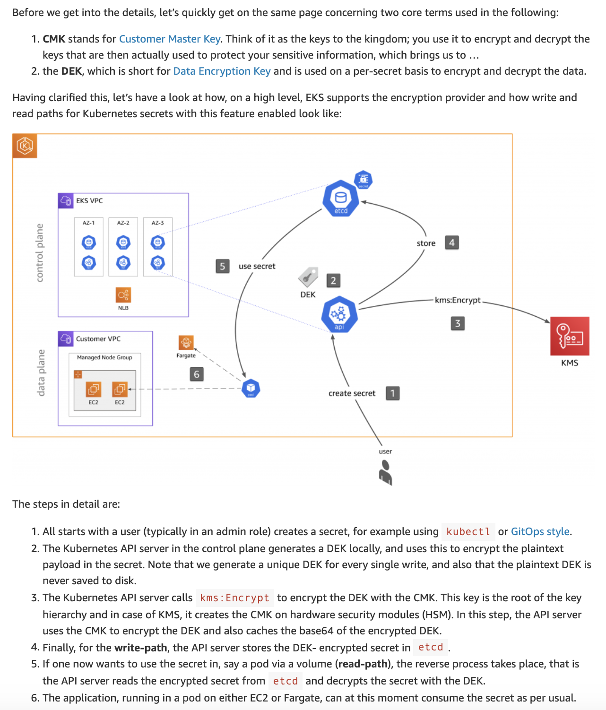

## General Notes:

Kubernetes secrets allow you to store and manage sensitive information, such as passwords, docker registry credentials, and TLS keys using the Kubernetes API. 

Kubernetes stores all secret object data within etcd and **all etcd volumes used by Amazon EKS are encrypted at the disk-level using AWS-managed encryption keys.**

### Envelope Encryption

One can further encrypt Kubernetes secrets with KMS keys that you create or import keys generated from another system to AWS KMS and use them with the cluster, without needing to install or manage additional software.

You can setup your own Customer Master Key (CMK) in KMS and link this key by providing the CMK ARN when you create an EKS cluster.

When secrets are stored using the Kubernetes secrets API, they are encrypted with a **Kubernetes-generated data encryption key, which is then further encrypted using the linked AWS KMS key.**

## More details below

